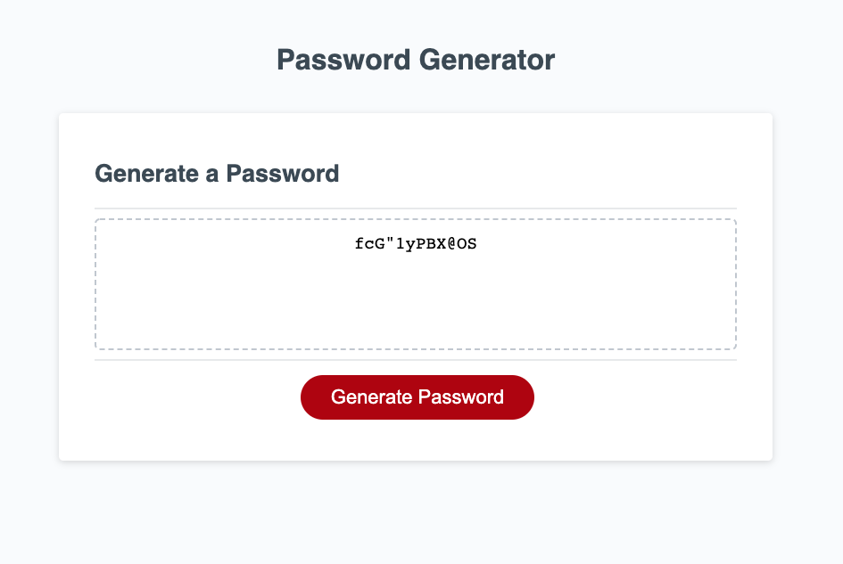

# Password Generator Starter Code
> Random Passwordd Generator for Challenge 3 at UCLAx Bootcamp!

## Table of contents
* [General info](#general-info)
* [Screenshots](#screenshots)
* [Technologies](#technologies)
* [Setup](#setup)
* [Status](#status)
* [Inspiration](#inspiration)
* [Contact](#contact)

## General info
This is a random password generator. It allows for user input for length and character types. 

## Screenshots

## Setup
Click the 'Generate Password' button! 

## Code 
* HTML
* CSS
* JAVASCRIPT

## Status
Project is complete! Thank you! 

## Inspiration
Inspiration :: UCLAx Bootcamp and a thrill for learning. 

## Contact
Javascript code by Alex Chigas. 